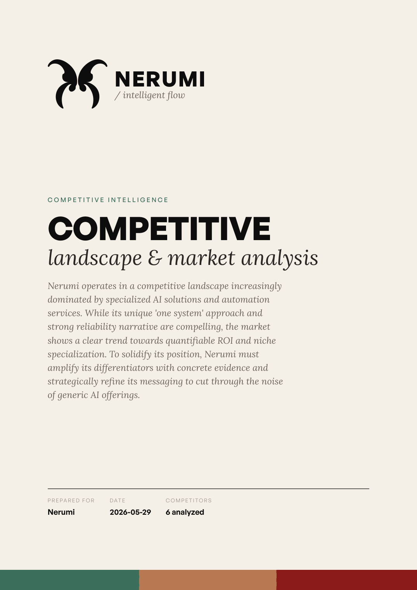
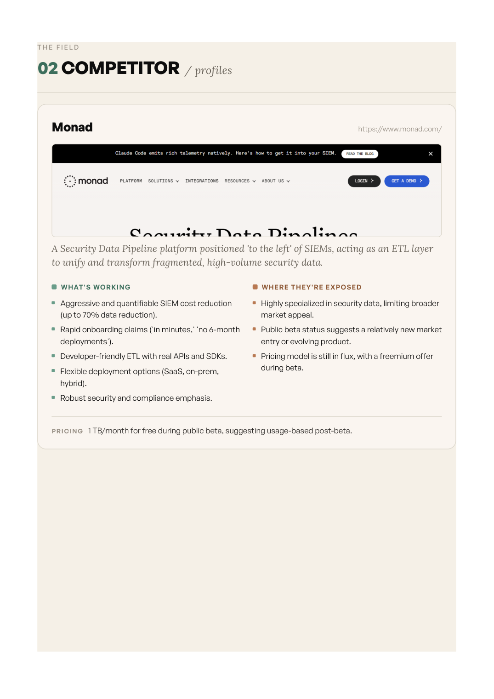
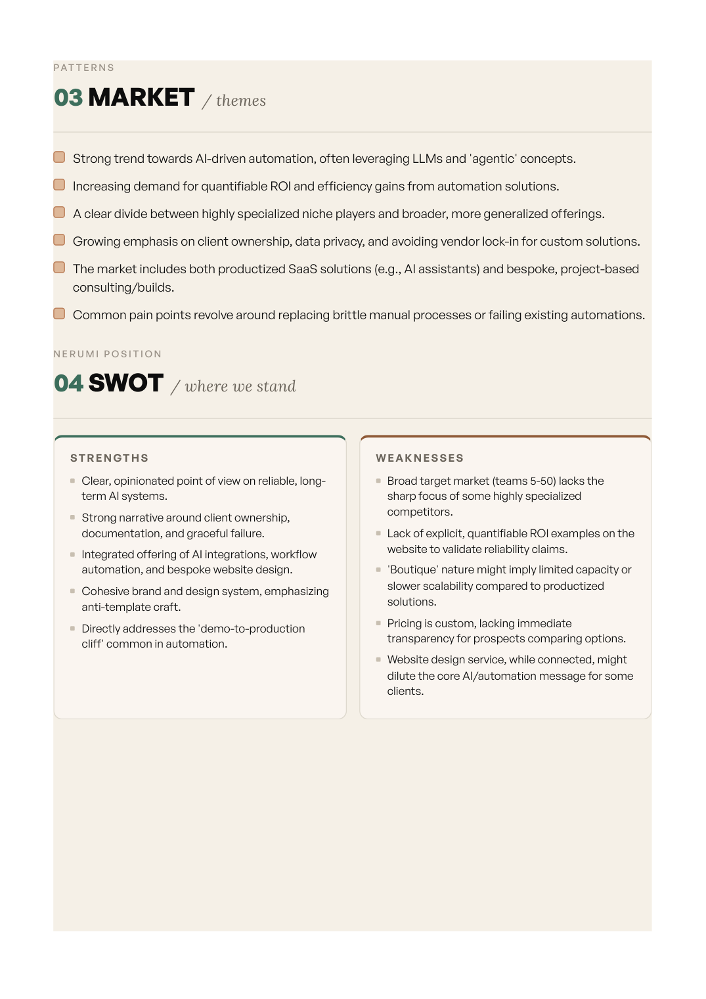

# Branded Competitor Analysis & Market-Monitoring Workflow

[](https://github.com/zenobioscastillo1-source/competitor-analysis-workflow/actions/workflows/ci.yml)
[](LICENSE)
[](https://www.python.org/)

Give it a business profile and a list of competitor URLs. Get back a **fully
brand-styled PDF competitive analysis**, a **living Google Sheet tracker**, and a
**weekly job that flags when a competitor changes their pricing or messaging**.

### Why it's built this way

When an AI agent performs *every* step itself, errors compound: five chained steps
at 90% accuracy each is only ~59% reliable end-to-end. So this project keeps the
**probabilistic reasoning in the agent** and pushes every repeatable step into
**small, deterministic, tested Python tools** — the **WAT architecture (Workflows ·
Agents · Tools)**. Plain-language SOPs say *what* to do; the agent orchestrates and
recovers from failures; the tools do the execution the same way every time. The
payoff is an automation you can actually trust to run unattended.

## Sample output

A report generated for [Nerumi](https://nerumi.io) (an AI-integrations studio) against
six real competitors — brand-styled cover, per-competitor profiles, market themes, a
SWOT, and prioritized recommendations. **[Full PDF →](docs/sample-report.pdf)**

<p align="center">
  <br><br>
  
  
</p>

## What it produces

| Deliverable | Description |
|-------------|-------------|
| **Branded PDF** | Multi-section report rendered from an HTML/CSS template via headless Chromium, with brand colors, logo, and typography embedded — fully self-contained. |
| **Google Sheet tracker** | One row per competitor (positioning, pricing, strengths, exposure) — the living record. |
| **Weekly market watch** | Re-scrapes the watchlist, diffs against stored baselines, and logs only *meaningful* changes (pricing/number shifts, title changes, substantial copy changes) to a `Changes` tab. |
| **Trend timeline** | Each run also records a dated snapshot to an append-only history log; `build_trends.py` turns it into a `History` tab + summary showing how each competitor's pricing/messaging has evolved over time. |

## Architecture

```
Inputs                          Tools (deterministic Python)          Output
──────────────────────────────────────────────────────────────────────────────
business profile  ┐   (optional) discover_competitors.py ─► candidate URLs
competitor URLs   ├─► scrape_single_site.py ─► clean text + links
brand kit         ┘            │   (Firecrawl fallback for blocked sites)
                     summarize.py (Gemini) ─► per-competitor summary
                                   │
                  analyze_competitors.py (Gemini) ─► structured analysis.json
                              │                            │
              render_pdf_report.py ◄──────────────────────┤
              (Jinja2 + Chromium, fonts/logo embedded) ─► branded PDF
                                                           │
                  push_to_google_sheet.py ◄────────────────┘  ─► Sheet tracker
Weekly:  monitor_competitors.py ─► diff vs baselines ─► Sheet "Changes" tab
                                │                   (+ optional Slack alert)
                                └─► append dated snapshot ─► monitor/history/*.jsonl
                  build_trends.py ─► trend summary ─────► Sheet "History" tab
```

## Tools

| Tool | Purpose |
|------|---------|
| `tools/discover_competitors.py` | Optional front-end: find competitors from the business profile via Gemini + Google Search grounding |
| `tools/scrape_single_site.py` | Fetch a URL → clean text + links |
| `tools/scrape_site_pages.py` | Optional deeper scrape: homepage + key sub-pages (pricing/about/…) into one document |
| `tools/firecrawl_scrape.py` | Optional escalation scraper (Firecrawl) for blocked / JS-heavy sites — same output shape |
| `tools/capture_screenshots.py` | Optional: capture competitor homepage screenshots to embed as thumbnails in the report |
| `tools/summarize.py` | Per-competitor summary via Google Gemini (retry + model fallback) |
| `tools/analyze_competitors.py` | Profile + summaries → structured JSON (SWOT, opportunities, recommendations) |
| `tools/render_pdf_report.py` | Analysis + brand kit → self-contained branded PDF |
| `tools/push_to_google_sheet.py` | Create / append the Google Sheet tracker |
| `tools/monitor_competitors.py` | Re-scrape, diff vs baseline, log changes + optional Slack, record a dated history snapshot |
| `tools/build_trends.py` | Summarize the history log into trends + (re)write the Sheet `History` tab |
| `tools/notify_slack.py` | Post a Slack message |

## Quick start

```bash
python -m venv .venv && .venv/Scripts/activate      # Windows; use source on macOS/Linux
pip install -r requirements.txt
playwright install chromium                          # for PDF rendering
cp .env.example .env                                 # then add your GEMINI_API_KEY
```

Then run the pipeline (full SOP in [`workflows/branded_competitor_report.md`](workflows/branded_competitor_report.md)):

```bash
# 1. scrape each competitor   2. summarize   3. assemble .tmp/competitors.json
python tools/scrape_single_site.py https://example.com --output example.json
python tools/summarize.py --input .tmp/example.json --output .tmp/example.summary.txt

# 4. analyze   5. render the branded PDF
python tools/analyze_competitors.py --profile inputs/business_profile.md \
    --competitors .tmp/competitors.json --output .tmp/analysis.json
python tools/render_pdf_report.py --analysis .tmp/analysis.json \
    --output reports/report.pdf
```

## Development

```bash
pip install -r requirements-dev.txt
ruff check .     # lint
pytest -q        # unit tests for the deterministic logic (change detection, JSON, rendering)
```

CI runs lint + tests on every push and pull request (see the badge above).

## Tech

Python · Google Gemini (`google-genai`) · Playwright/Chromium · Jinja2 ·
BeautifulSoup · Google Sheets API · Slack SDK · Firecrawl (optional).

## Notes

- **Brand kit is data-driven:** `brand/brand_kit.json` defines colors, fonts, and the
  logo; the renderer base64-embeds fonts + logo so the PDF is fully self-contained.
- **Resilient by design:** the Gemini tools retry transient errors and fall back across
  models; scraping escalates requests → Playwright → Firecrawl.
- **Secrets** live in `.env` / local credential files (gitignored) — see `.env.example`.

Fonts in `brand-assets/fonts/` are redistributed under their respective licenses
(General Sans — Indian Type Foundry Free Font License; Lora — SIL Open Font License).
